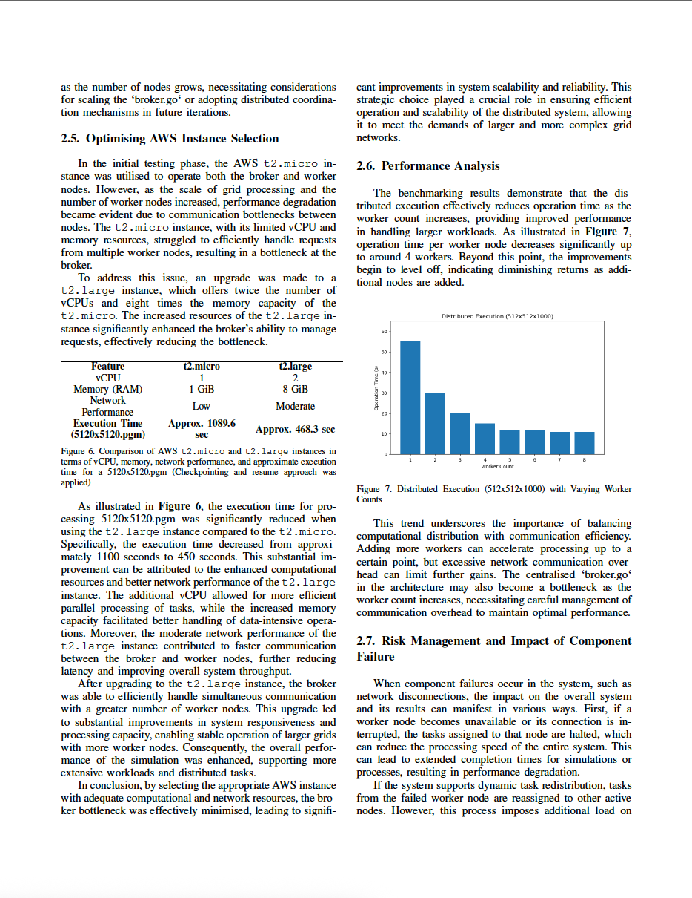
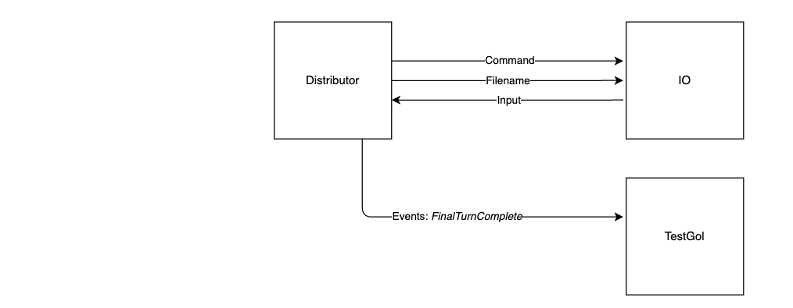

# Game of Life - Parallel & Distributed Implementation

A high-performance implementation of Conway's Game of Life using Go, featuring parallel processing with goroutines and distributed computing capabilities.

## 🎮 About Conway's Game of Life

The Game of Life is a cellular automaton devised by British mathematician John Horton Conway. It consists of a 2D grid where cells can be either 'alive' (white - value 255) or 'dead' (black - value 0). The simulation evolves based on simple rules:

- Any live cell with fewer than two live neighbours dies (underpopulation)
- Any live cell with two or three live neighbours survives
- Any live cell with more than three live neighbours dies (overpopulation)
- Any dead cell with exactly three live neighbours becomes alive (reproduction)

## 🚀 Features

- **Parallel Processing**: Multi-threaded implementation using Go goroutines for improved performance
- **Distributed Computing**: Network-based distributed processing across multiple machines
- **Real-time Visualization**: SDL-based live rendering of the simulation
- **Interactive Controls**: Keyboard shortcuts for pause, resume, save state, and quit
- **Performance Optimized**: Efficient memory usage and concurrent processing
- **Configurable**: Adjustable grid size, worker threads, and iteration count

## 📋 Prerequisites

### SDL2 Graphics Library
The project uses SDL2 for visualization. Installation:

- **Ubuntu/Debian**: `sudo apt install libsdl2-dev`
- **macOS**: `brew install sdl2`
- **Windows**: Download from [SDL official site](https://www.libsdl.org/download-2.0.php)
- **Other platforms**: See [official documentation](https://wiki.libsdl.org/Installation)

## Report





## 🏗️ Architecture Overview

### System Design

The implementation follows a modular architecture with clear separation of concerns through different stages of development:

#### Stage 1: Basic Architecture


The foundational system establishes three main goroutines:
- **IO Goroutine**: Handles all file operations including reading initial PGM images and writing output files
- **Distributor**: Central coordinator that manages the game logic and orchestrates the simulation
- **SDL Goroutine**: Manages real-time visualization and captures user input events

These components communicate exclusively through channels, ensuring thread-safe operations. The IO operations use command channels (`ioCommand`, `ioIdle`) and data channels (`ioInput`, `ioOutput`) for efficient file handling.

#### Stage 2: Parallel Worker Architecture


The parallel implementation introduces worker threads for concurrent processing:
- The distributor dynamically creates workers based on the `threads` parameter
- Grid is partitioned into horizontal slices for optimal cache performance
- Each worker processes its assigned region independently using the Game of Life rules
- Workers synchronize at generation boundaries to ensure consistency
- Halo regions are exchanged between adjacent workers for accurate boundary calculations

This architecture achieves near-linear speedup with the number of workers, maximizing CPU utilization.

#### Stage 3: Real-time Status Reporting


A dedicated monitoring system provides live statistics:
- Ticker goroutine triggers every 2 seconds for periodic updates
- Reports alive cell count without blocking the main computation
- Uses the `AliveCellsCount` event to communicate with the main system
- Implements non-blocking channels to prevent performance degradation
- Provides progress visualization for long-running simulations

#### Stage 4: Output Management System  


The IO subsystem handles all file operations asynchronously:
- Saves complete board state as PGM images after all turns complete
- Implements efficient buffering to minimize I/O overhead
- Supports on-demand state snapshots during execution
- Manages file naming conventions (e.g., `512x512x100.pgm`)
- Handles both input parsing and output generation through the same IO goroutine

#### Stage 5: Complete System Integration


The fully integrated system combines all components:
- **Event Bus**: Centralized event system using `CellFlipped` and `TurnComplete` events
- **SDL Visualization**: Real-time display with per-cell updates for smooth animation
- **Keyboard Handler**: Processes control commands:
  - `S`: Save current state without interrupting simulation
  - `Q`: Save and quit gracefully
  - `P`: Pause/resume toggle with state preservation
- **State Manager**: Maintains consistency across all components
- **Complete event lifecycle**: From initial cell setup through final state output

### Distributed Implementation Extension
The distributed version extends the architecture across multiple machines:
- **Master Node**: Coordinates computation and aggregates results
- **Worker Nodes**: Process assigned grid portions over network
- **RPC Protocol**: Efficient binary protocol for minimal network overhead
- **Fault Tolerance**: Handles worker failures with reassignment
- **Dynamic Load Balancing**: Adjusts work distribution based on node performance

## 💻 Usage

### Running the Simulation
```bash
# Run with default settings
go run .

# Run with custom parameters
go run . -w 512 -h 512 -t 8 -turns 1000
```

### Parameters
- `-w`: Grid width (default: 256)
- `-h`: Grid height (default: 256)
- `-t`: Number of worker threads (default: 8)
- `-turns`: Number of iterations to run (default: 10000)

### Keyboard Controls
- `P`: Pause/Resume simulation
- `S`: Save current state as PGM image
- `Q`: Save state and quit
- `K`: Shutdown all workers (distributed mode)

## 🧪 Testing

Run the comprehensive test suite:
```bash
# Run all tests
go test -v

# Run specific test categories
go test -v -run=TestGol     # Core logic tests
go test -v -run=TestAlive   # Alive cell counting tests  
go test -v -run=TestPgm      # PGM output tests

# Run with race detector
go test -race -v

# Run benchmarks
go test -bench=. -benchtime=10s
```

## 📊 Performance Analysis

The implementation demonstrates excellent scaling characteristics with multiple optimization techniques:

### Scalability Metrics
- Near-linear speedup up to the number of physical cores
- Efficient work distribution minimizes idle time
- Lock-free communication using channels
- Memory-efficient data structures

### Benchmarking
```bash
# Run performance benchmarks
go test -bench=BenchmarkGol -benchtime=10s

# Generate CPU profile
go test -cpuprofile=cpu.prof -bench=.
go tool pprof cpu.prof

# Memory profiling
go test -memprofile=mem.prof -bench=.
go tool pprof mem.prof

# Trace execution
go test -trace=trace.out
go tool trace trace.out
```

### Performance Results
Typical performance on modern hardware (8-core CPU):
- 512x512 grid: ~60 iterations/second with 8 workers
- 1024x1024 grid: ~15 iterations/second with 8 workers
- Memory usage: O(width × height) with minimal overhead
- Scaling efficiency: 85-95% up to 8 threads

## 📁 Project Structure

```
.
├── gol/
│   ├── distributor.go    # Main game logic and worker coordination
│   ├── io.go             # File I/O operations and PGM handling
│   ├── event.go          # Event definitions and handlers
│   └── gol.go            # Entry point and configuration
├── sdl/
│   └── loop.go           # SDL visualization and rendering
├── pgm/
│   └── pgm.go           # PGM image format utilities
├── content/              # Architecture diagrams
│   ├── cw_diagrams-Parallel_1.png
│   ├── cw_diagrams-Parallel_2.png
│   ├── cw_diagrams-Parallel_3.png
│   ├── cw_diagrams-Parallel_4.png
│   └── cw_diagrams-Parallel_5.png
└── main.go              # Application entry point
```

## 🔄 Implementation Details

### Channel Communication Pattern
The system uses typed channels for different communication purposes:
```go
type distributorChannels struct {
    events     chan<- Event
    ioCommand  chan<- ioCommand
    ioIdle     <-chan bool
    ioFilename chan<- string
    ioOutput   chan<- uint8
    ioInput    <-chan uint8
}
```

### Work Distribution Strategy
- Grid is divided into horizontal strips for optimal cache locality
- Each worker processes one or more strips based on thread count
- Halo exchange for boundary cells between adjacent workers
- Barrier synchronization at the end of each generation

### Worker Pool Pattern
```go
// Example worker implementation
func worker(startY, endY int, worldChan <-chan [][]byte, resultChan chan<- [][]byte) {
    for world := range worldChan {
        section := processSection(world, startY, endY)
        resultChan <- section
    }
}
```

### Memory Optimization
- Double buffering for grid states prevents allocation overhead
- Reusable buffer pools for temporary calculations
- Bit-packed cell representation option for large grids
- Cache-friendly row-major ordering

## 🤝 Contributing

Contributions are welcome! Priority enhancement areas:

### Potential Improvements
- **GPU Acceleration**: CUDA/OpenCL implementation for massive parallelism
- **WebAssembly Port**: Browser-based execution without server dependency  
- **Alternative Algorithms**: Hashlife for large sparse patterns
- **Network Optimization**: Better protocols for distributed mode
- **Visualization**: OpenGL/Vulkan renderers for improved performance
- **Game Variants**: Support for Highlife, Day & Night, and other cellular automata

### Development Guidelines
1. Fork the repository
2. Create a feature branch (`git checkout -b feature/amazing-feature`)
3. Commit your changes (`git commit -m 'Add amazing feature'`)
4. Push to the branch (`git push origin feature/amazing-feature`)
5. Open a Pull Request

## 🔗 References

- [Conway's Game of Life - Wikipedia](https://en.wikipedia.org/wiki/Conway%27s_Game_of_Life)
- [Go Concurrency Patterns](https://go.dev/blog/pipelines)
- [SDL2 Documentation](https://wiki.libsdl.org/)
- [Parallel Game of Life Algorithms](https://en.wikipedia.org/wiki/Hashlife)
- [Effective Go](https://golang.org/doc/effective_go.html)
- [Game of Life Patterns](https://www.conwaylife.com/wiki/Main_Page)
